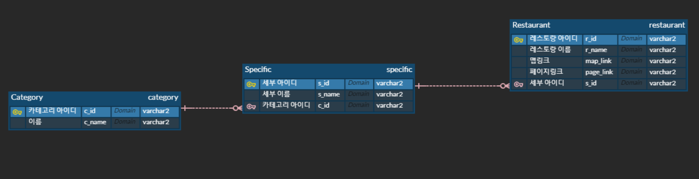

:fork_and_knife: Restaurant Recommandtion System 
================================================

#

## :pencil:Description
매번 점심 메뉴를 정하느라 낭비하는 시간을 절약하기 위해 play data학원을 중심으로 한식, 중식, 양식, 일식 카테고리 별로 맛집을 추천해주는 프로그램

#

## :bar_chart:ER Diagram


#

## :mag:페이지 프로세스 (oven url)
https://ovenapp.io/view/1AGe1dM0HzIfbU4de1wGfCy8VWyBBqGu/

#

## :question::exclamation:Issue
> 1. 엔티티의 모든 속성이 아닌 특정 속성만 select하는 상황
- select * 인 경우 entity.class로 매핑됨
- select id 인 경우 String이 결과로 반환되기 때문에 entity class로 매핑이 안됨.
- 따라서 Query createNativeQuery(String sqlString, Class resultClass)메소드 대신 Query createNativeQuery(String sqlString)메소드 사용하여 해결

<details>
<summary>문제 발생 부분</summary>
<div markdown="1">

```java
@Slf4j
public class CategoryDAO {
	//cname으로 cid 찾아오기
	public static String getCid(String cname) throws Exception {
		EntityManager em = PublicCommon.getEntityManger();
		String cid = null;

		try {
			 cid = String.valueOf(em.createNativeQuery("select c_id from category where c_name=?")
					.setParameter(1, cname).getSingleResult());
                    /* 문제 발생 코드
                    String.valueOf(em.createNativeQuery("select c_id from category where c_name=?",CategoryEntity.class)
					.setParameter(1, cname).getSingleResult());*/
				if (cid == null) {
				log.info("select category id 실패");
				throw new NotExistException("select category id 실패");
			}
		} catch (Exception e) {
			log.warn("getCid : 오류발생");
			e.printStackTrace();
			throw e;
		} finally {
			em.close();
		}
		return cid;
	}
}
```
</div>
</details>

<details>
<summary>Query createNativeQuery 메소드</summary>
<div markdown="1">

```java
    /**
     * Create an instance of <code>Query</code> for executing
     * a native SQL query.
     * @param sqlString a native SQL query string
     * @param resultClass the class of the resulting instance(s)
     * @return the new query instance
     */
    public Query createNativeQuery(String sqlString, Class resultClass);

    /**
     * Create an instance of <code>Query</code> for executing
     * a native SQL statement, e.g., for update or delete.
     * If the query is not an update or delete query, query
     * execution will result in each row of the SQL result
     * being returned as a result of type Object[] (or a result
     * of type Object if there is only one column in the select
     * list.)  Column values are returned in the order of their
     * appearance in the select list and default JDBC type
     * mappings are applied.
     * @param sqlString a native SQL query string
     * @return the new query instance
     */
    public Query createNativeQuery(String sqlString);
```
</div>
</details>

#

> 2. Entity에 FK변수 추가시 주의점
- table에서는 varchar2타입의 FK가 Entity에서는 참조하는 객체 타입으로 변수선언됨
- 따라서 String값으로 입력된 파라메터를 객체 타입으로 반환하는 메소드를 구현


<details>
<summary>RestaurantEntity</summary>
<div markdown="1">

```java
@Entity
@Table(name="restaurant")
public class RestaurantEntity {
		
@Id
@Column(name="r_id")
private String rid;
		
@Column(name="r_name")
private String rname;
		
@ManyToOne
@JoinColumn(name="s_id")
private SpecificEntity sid;
		
@Column(name="map_link")
private String maplink;
		
@Column(name="page_link")
private String pagelink;				
}
	
 ```

</div>
</details>

<details>
<summary>SpecifictEntity</summary>
<div markdown="1">

```java

@Entity
@Table(name="specific")
public class SpecificEntity {
	
	@Id
	@Column(name="s_id")
	private String sid;
	
	@Column(name="s_name")
	private String sname;
	
	@ManyToOne
	@JoinColumn(name="c_id")
	private CategoryEntity cid;
	
	@OneToMany(mappedBy="sid")	
	private List<RestaurantEntity> restaurants;
}
	
 ```

</div>
</details>

<details>
<summary>restaurant insert 코드</summary>
<div markdown="1">

```java

		String url = "showError.jsp";
		String rid = request.getParameter("rid");
		String rname = request.getParameter("rname");
		SpecificEntity sid=null;
		String maplink = request.getParameter("maplink");
		String pagelink = request.getParameter("pagelink");
		
		
		sid = FoodService.getSpecificEntity(request.getParameter("sname"));
		RestaurantEntity restaurant = new RestaurantEntity(rid, rname, sid, maplink, pagelink);
	
 ```

</div>
</details>

#

> 3. JSTL에서 엔티티의 FK(객체참조변수)의 string값에 접근
- table에서는 varchar2타입의 FK가 Entity에서는 참조하는 객체 타입으로 변수선언됨
- data라는 객체(Specific Entity타입)의 String타입의 c_id를 추출하기 위해 data.cid(Category Entity타입).cid(String 타입)으로 접근
- JSTL에서 문자열 비교시 '='시 문제 발생, 'eq' 사용하여 해결

<details>
<summary>restaurant insert 코드</summary>
<div markdown="1">

```java

<c:forEach items="${sessionScope.specifics}" var="data">
	<c:choose>
		<c:when test="${data.cid.cid eq 'c_1'}">
```

</div>
</details>